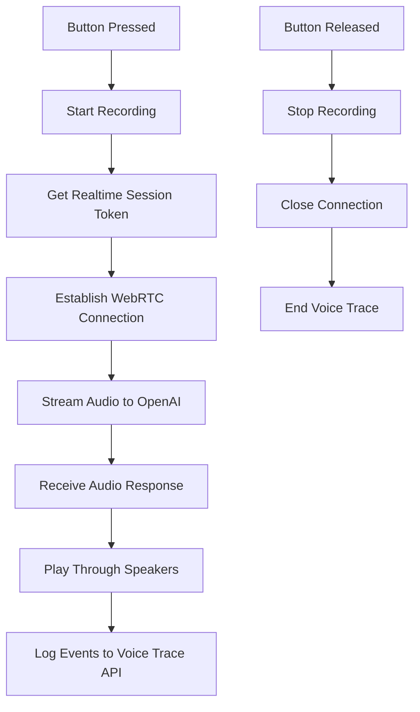

# Raspberry Pi Voice Client Implementation Plan

## Project Name

`pi-voice-client` - A standalone Python application for Raspberry Pi that provides push-to-talk voice interaction with the Carrie AI system.

## Architecture Overview

The application will:

1. Monitor a GPIO button for push-to-talk input
2. Record audio from microphone while button is pressed
3. Connect to OpenAI Realtime API via WebRTC (using existing `/v1/realtime/session` endpoint)
4. Stream audio to OpenAI and receive audio responses
5. Play responses through speakers
6. Log events to the voice trace API (`/v1/voice/trace/*`)



## Project Structure

```javascript
pi-voice-client/
├── src/
│   ├── __init__.py
│   ├── main.py                 # Main application entry point
│   ├── audio_handler.py       # Audio recording and playback
│   ├── button_handler.py      # GPIO button monitoring
│   ├── webrtc_client.py       # WebRTC connection to OpenAI
│   ├── voice_trace_client.py  # Voice trace API integration
│   └── config.py              # Configuration management
├── requirements.txt            # Python dependencies
├── README.md                  # Setup and usage instructions
└── .env.example               # Configuration template
```


## Implementation Tasks

### 1. Project Setup (`pi-voice-client/`)

- Create project directory structure
- Add `requirements.txt` with dependencies:
- `aiortc` - WebRTC support
- `pyaudio` - Audio I/O
- `RPi.GPIO` - GPIO button handling
- `python-dotenv` - Environment configuration
- `httpx` - HTTP client for API calls
- `asyncio` - Async operations

### 2. Configuration Module (`src/config.py`)

- Load configuration from environment variables:
- `API_BASE_URL` - Backend API URL (default: `http://localhost:8001`)
- `BUTTON_GPIO_PIN` - GPIO pin for button (default: 18)
- `AUDIO_SAMPLE_RATE` - Audio sample rate (default: 24000)
- `AUDIO_CHANNELS` - Audio channels (default: 1 for mono)
- `AUDIO_CHUNK_SIZE` - Audio chunk size in frames

### 3. Button Handler (`src/button_handler.py`)

- Monitor GPIO pin for button state changes
- Implement push-to-talk logic:
- Button pressed: Start recording
- Button released: Stop recording and send
- Use edge detection to handle button press/release events
- Debounce button input to prevent false triggers

### 4. Audio Handler (`src/audio_handler.py`)

- Initialize PyAudio for microphone input and speaker output
- Record audio in chunks while button is pressed
- Play audio chunks received from OpenAI
- Handle audio format conversion (PCM, sample rate, channels)
- Manage audio buffers for streaming

### 5. Voice Trace Client (`src/voice_trace_client.py`)

- Integrate with existing voice trace API endpoints:
- `POST /v1/voice/trace/start` - Start session
- `POST /v1/voice/trace/event` - Log events (transcript, response, function calls)
- `POST /v1/voice/trace/end` - End session
- Generate unique session IDs
- Track message count and duration
- Handle API errors gracefully (non-blocking)

### 6. WebRTC Client (`src/webrtc_client.py`)

- Connect to backend `/v1/realtime/session` endpoint to get session credentials
- Establish WebRTC peer connection to OpenAI Realtime API
- Send audio stream from microphone
- Receive audio stream from OpenAI
- Handle Realtime API events:
- `conversation.item.input_audio_transcription.completed` - Log user transcript
- `response.audio.delta` - Receive audio chunks
- `response.text.delta` - Log response text
- `response.function_call_arguments.done` - Log function calls
- `response.done` - Handle response completion
- Implement connection lifecycle management

### 7. Main Application (`src/main.py`)

- Initialize all components (button, audio, WebRTC, voice trace)
- Coordinate button events with recording/playback
- Manage application state (idle, recording, processing, playing)
- Handle errors and cleanup
- Implement graceful shutdown on SIGINT/SIGTERM

### 8. Documentation (`README.md`)

- Hardware requirements (Raspberry Pi model, microphone, speaker, button)
- Software setup instructions
- GPIO pin configuration
- Environment variable configuration
- Running the application
- Troubleshooting guide

## Key Technical Considerations

1. **WebRTC on Raspberry Pi**: Use `aiortc` library which supports Python WebRTC. May require additional system dependencies.
2. **Audio Format**: OpenAI Realtime API expects PCM audio at 24kHz, 16-bit, mono. Ensure proper format conversion.
3. **Button Debouncing**: Implement hardware or software debouncing to prevent multiple triggers from single press.
4. **Error Handling**: Gracefully handle network errors, API failures, and audio device issues without crashing.
5. **Resource Management**: Properly close audio streams, WebRTC connections, and GPIO resources on shutdown.
6. **Voice Trace Integration**: Voice trace API is optional (controlled by `LANGFUSE_ENABLED`), so handle cases where it's disabled.

## Dependencies

- Python 3.9+
- System packages (via apt): `portaudio19-dev`, `python3-dev`
- Python packages: See `requirements.txt`

## Integration Points

- **Backend API**: Uses existing `/v1/realtime/session` endpoint from [backend/routes/realtime.py](backend/routes/realtime.py)
- **Voice Trace API**: Uses existing `/v1/voice/trace/*` endpoints from [backend/routes/voice_trace.py](backend/routes/voice_trace.py)
- **Configuration**: Backend API base URL configurable via environment variable

## Testing Considerations